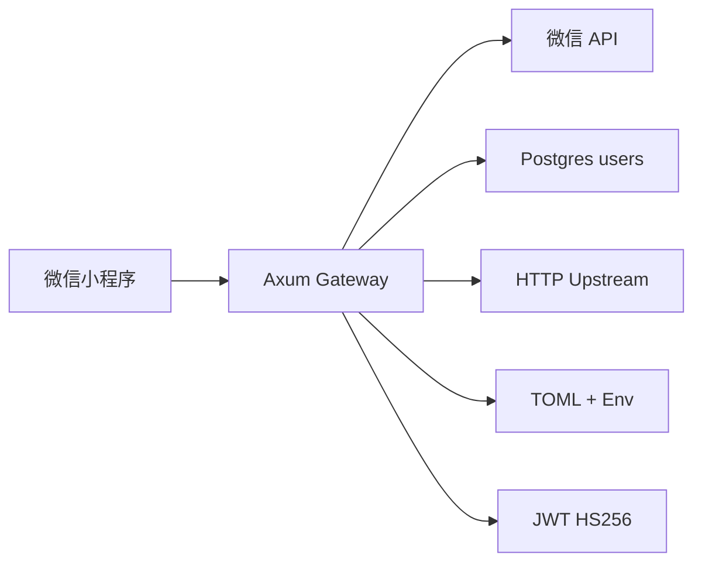

# 架构说明

`services/gateway` 是一个单进程 Rust HTTP 网关。它负责把微信小程序登录态转换为业务用户身份，签发 JWT，并在代理业务请求前注入可信用户上下文。

## 系统概览

网关接收来自微信小程序前端的登录 code 或手机号授权 code，调用微信服务端 API 换取身份信息，使用 Postgres 保存用户绑定关系，并向客户端返回业务 JWT。业务 API 请求带 JWT 进入网关后，网关验证 token、加载用户、清洗客户端伪造身份头，再转发给配置的 upstream。

## 组件图



## 请求流

微信登录：

1. 小程序调用 `wx.login()` 获得临时 `code`。
2. 前端请求 `POST /api/v1/auth/wechat-login`。
3. `app.rs` 调用 `WeChatClient::code2_session`。
4. `wechat.rs` 请求微信 `/sns/jscode2session`。
5. `store.rs` 通过 `openid` 查找或创建用户。
6. `jwt.rs` 使用用户 `id` 签发 JWT。

手机号组合登录：

1. 前端提交 `login_code + phone_code`。
2. 网关分别调用 `code2Session` 和 `getPhoneNumber`。
3. `wechat.rs` 校验手机号响应里的 `watermark.appid`。
4. `store.rs` 在事务内检查 `openid` 用户和手机号用户是否冲突。
5. 无冲突时创建或更新同一个用户并签发 JWT。

受保护代理：

1. 请求命中 fallback 代理。
2. `app.rs` 从 `Authorization: Bearer <token>` 中解析 JWT。
3. `jwt.rs` 验证签名和过期时间，取出用户 `id`。
4. `store.rs` 从数据库加载用户。
5. `proxy.rs` 选择最长匹配的 upstream prefix。
6. `proxy.rs` 清理不可信身份头并注入 `x-gateway-authenticated`、`x-user-id` 等头。
7. 请求转发到下游 HTTP 服务。

## 关键抽象

| Abstraction | File | Purpose |
| --- | --- | --- |
| `AppState` | `services/gateway/src/app.rs` | Axum handler 共享的运行时依赖集合。 |
| `router` | `services/gateway/src/app.rs` | 注册健康检查、认证接口和 fallback 代理。 |
| `WeChatClient` | `services/gateway/src/wechat.rs` | 封装微信 `code2Session`、`access_token` 缓存和手机号接口。 |
| `UserStore` | `services/gateway/src/store.rs` | 用户读写能力接口，便于 handler 测试使用内存实现。 |
| `PostgresUserStore` | `services/gateway/src/store.rs` | `UserStore` 的 Postgres 实现。 |
| `JwtManager` | `services/gateway/src/jwt.rs` | 业务 JWT 的签发和验证。 |
| `GatewayConfig` | `services/gateway/src/config.rs` | TOML 配置结构。 |
| `ResolvedConfig` | `services/gateway/src/config.rs` | 已解析敏感环境变量后的运行时配置。 |
| `ApiError` | `services/gateway/src/error.rs` | 统一错误到 HTTP JSON 响应的映射。 |

## 数据模型

用户表由 `services/gateway/migrations/0001_create_users.sql` 创建：

```text
users
├── id UUID PRIMARY KEY
├── openid TEXT
├── unionid TEXT
├── country_code TEXT
├── pure_phone_number TEXT
├── phone_number TEXT
├── phone_verified_at TIMESTAMPTZ
├── created_at TIMESTAMPTZ
└── updated_at TIMESTAMPTZ
```

索引策略：

- `openid` 使用部分唯一索引，只有非空时唯一。
- `(country_code, pure_phone_number)` 使用部分唯一索引，只有两列都非空时唯一。
- 当 `openid` 和手机号命中不同用户时，业务层返回 `409 account_conflict`，不自动合并账号。

## 目录职责

```text
services/gateway/src/
├── app.rs       # HTTP route handlers and AppState
├── config.rs    # TOML/env configuration
├── error.rs     # API error mapping
├── jwt.rs       # JWT issue/verify
├── lib.rs       # library module exports
├── main.rs      # process bootstrap
├── models.rs    # user and response models
├── proxy.rs     # authenticated reverse proxy
├── store.rs     # user storage trait and Postgres implementation
└── wechat.rs    # WeChat API client
```

## 当前边界

- `access_token` 是进程内缓存，适合第一版单实例部署。
- 不持久化微信 `session_key`。
- 不提供纯手机号登录入口。
- 不向下游默认注入完整手机号。
- TLS、合法域名和公网入口由外层反向代理或云网关负责。
